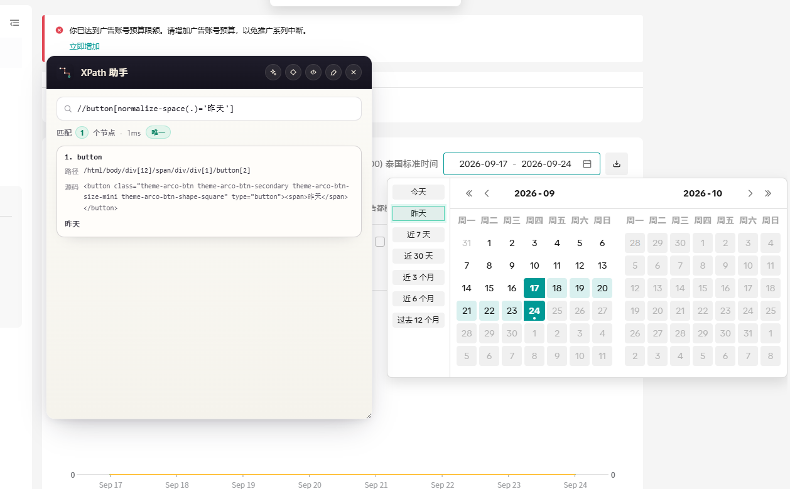
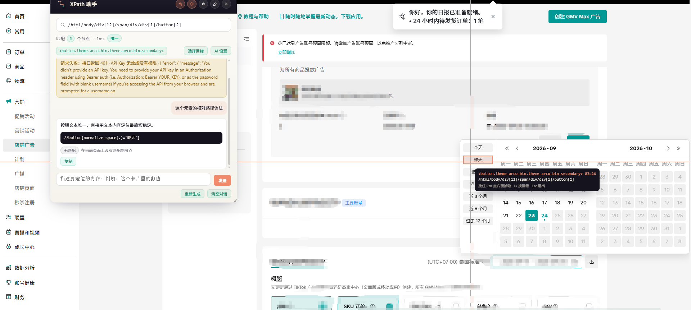
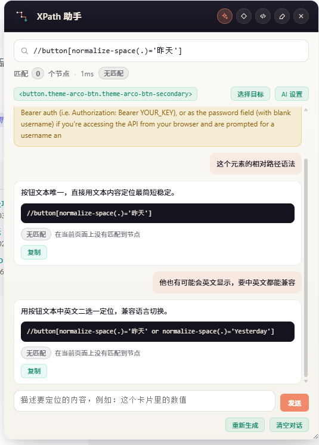
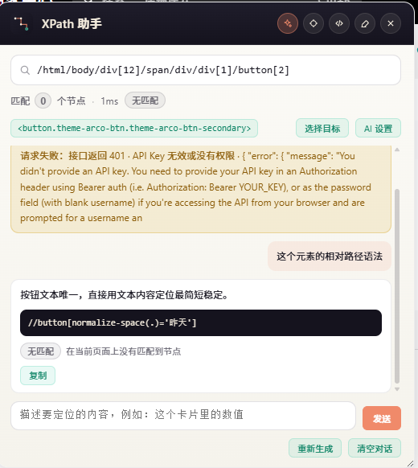
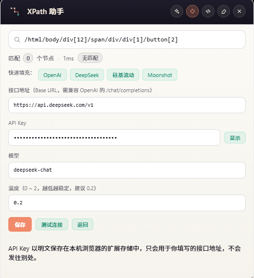
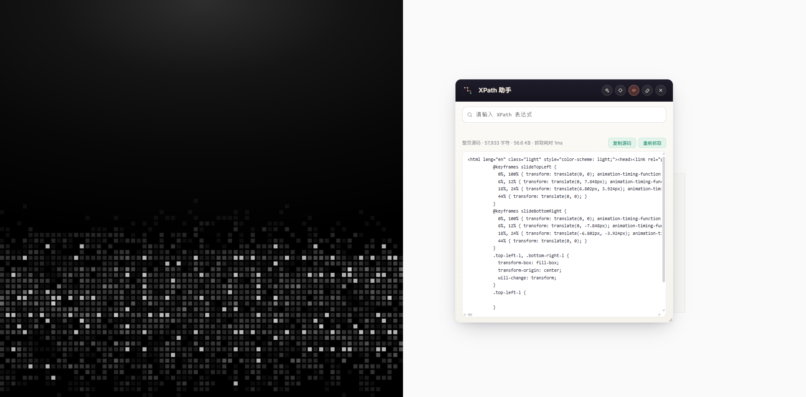

# XPath AI 助手

**在网页上点选元素直接生成唯一 XPath，内置唯一性校验，并可用 AI 对话生成与修正表达式。**

一个免构建的 Chrome / Edge 浏览器扩展，原生 JavaScript，无任何运行时依赖。

> A no-build Chrome/Edge extension that generates verified-unique XPath expressions by picking elements on the page, and can refine them through an AI chat.



---

## 目录

- [为什么做这个](#为什么做这个)
- [功能](#功能)
- [截图](#截图)
- [安装](#安装)
- [使用](#使用)
  - [获取元素](#获取元素)
  - [唯一性校验与自动收紧](#唯一性校验与自动收紧)
  - [AI 对话生成 XPath](#ai-对话生成-xpath)
  - [抓取整页源代码](#抓取整页源代码)
- [AI 配置](#ai-配置)
- [权限与隐私](#权限与隐私)
- [关键设计](#关键设计)
- [目录结构](#目录结构)
- [开发与调试](#开发与调试)
- [已知限制](#已知限制)
- [License](#license)

---

## 为什么做这个

写 XPath 采集规则时，真正的难点不是语法，而是**保证唯一性和稳定性**：

- 手写 `//div[@class="item"]` 看着没问题，实际可能匹配到几十个元素
- 绝对路径一定唯一，但页面改版就失效
- 把几 MB 的整页源码丢给 AI，会被上下文截断，模型也抓不住重点 —— 而且**它无法判断自己给的选择器是否唯一**，那需要对整篇文档计数，这是模型结构上做不到的事

所以这个扩展的思路是：**把「找结构」和「验唯一性」分开**。

| 环节 | 由谁负责 |
| --- | --- |
| 确定你要哪个元素 | **你点一下**（不靠猜） |
| 把元素翻译成表达式 | AI（或直接生成结构路径） |
| 判断表达式是否唯一 | **`document.evaluate` 实际执行**（不靠心算） |
| 不唯一时收紧 | **纯机械收紧**，不需要 AI |

---

## 功能

- **获取元素** —— 在页面上 `Ctrl` + 右键点选任意元素，自动生成唯一 XPath 并立即定位
- **唯一性校验** —— 每次求值后直接给出「唯一 / 不唯一 / 无匹配」结论
- **一键收紧** —— 表达式不唯一时，自动收紧成只匹配目标元素的版本
- **AI 对话生成** —— 用自然语言描述需求，基于捕获到的元素结构生成 XPath，并当场校验
- **执行结果回传** —— 把校验结果自动喂回模型，让它越调越准，而不是反复试错
- **整页源码抓取** —— 一键导出当前 DOM 序列化结果，可整段复制
- **结果面板** —— 展示匹配数量、求值耗时、每个节点的 XPath 路径 / 源码 / 文本内容
- **高亮与定位** —— 匹配元素在页面上高亮，悬停预览、点击滚动定位
- 支持元素、属性、文本、注释等节点类型，也支持返回字符串 / 数字 / 布尔值的表达式
- 面板可拖动、缩放，自动避开被遮挡的目标元素，并记住上次位置

---

## 截图

### 获取元素

按住 `Ctrl` 点右键拾取，十字参考线跟随鼠标，浮动标签实时显示标签名、尺寸和对应 XPath。拾取期间页面仍可正常操作。



### 结果卡片

匹配数量与耗时、XPath 路径、源码、文本内容，以及唯一性结论，一屏看完。


### AI 对话

描述需求即可生成，返回的表达式**当场在页面上执行并把结果标在对话里** —— 唯一 / 不唯一 / 无匹配一目了然，可直接填入或一键收紧。



### AI 校验



### AI 设置

支持 OpenAI / DeepSeek / 硅基流动 / Moonshot 快速填充，并提供「测试连接」直接验证配置是否可用，不用靠试错。



### 抓取整页源码

抓取的是**当前实时 DOM**，不是服务端返回的原始 HTML。页面变化后会提示重新抓取。



---

## 安装

### 从源码加载（开发 / 自用）

1. 下载或克隆本仓库
2. 打开扩展管理页：
   - Chrome：`chrome://extensions/`
   - Edge：`edge://extensions/`
3. 打开右上角「开发者模式」
4. 点「加载已解压的扩展程序」，选择**直接包含 `manifest.json` 的那一层目录**

   > 这一步最容易选错。选中后文件列表里应该能直接看到 `manifest.json`。如果选的是它的上级目录，Chrome 会报「清单文件缺失或不可读取」。

5. 打开任意普通网页，点工具栏里的扩展图标即可

### 从压缩包安装

仓库 Releases 里的 `.zip` 解压后，按上面的步骤选择解压出来的目录即可。注意 Chrome **不能直接加载 `.zip`**，必须先解压。

---

## 使用

### 获取元素

点面板顶部的准星按钮进入拾取模式：

- 页面上有十字参考线跟随鼠标
- 鼠标划过的元素会被橙色边框框住，浮动标签实时显示 `标签#id.类名`、尺寸和对应 XPath
- **按住 `Ctrl` 点鼠标右键**完成拾取，XPath 自动填入输入框并立即求值、定位
- `↑` / `↓` 调整拾取层级 —— `↑` 上溯到父元素，`↓` 下钻回子元素
- `Esc` 退出拾取模式；再点一次准星按钮也可以退出

**为什么用 `Ctrl` + 右键而不是单击**：因为拾取期间页面仍然可以正常操作 —— 左键点击、滚动、悬停、展开下拉菜单都不受影响，只有 `Ctrl` + 右键才会被识别成拾取。这样你可以先点开菜单、切到需要的标签页，等目标元素出现了再拾取，不必反复进出拾取模式。

> 代价是拾取期间点击仍会触发页面上的按钮，在后台系统里操作时留意别点到危险按钮。

生成的 XPath 优先使用唯一 `id` 作为锚点，没有可用 `id` 时生成带位置谓词的路径，**保证唯一**。

### 唯一性校验与自动收紧

每次求值后，状态栏会给出明确结论：

| 徽标 | 含义 |
| --- | --- |
| 唯一 | 只匹配 1 个节点，可以直接使用 |
| 不唯一 | 匹配多个节点，不满足唯一性 |
| 无匹配 | 没有匹配到任何节点 |

结论是「不唯一」时，点选任意一个结果，状态栏会出现「收紧为唯一」按钮。点击后按下面的顺序尝试，**每一种都会在页面上实际求值验证，验证通过才采用**：

1. **追加唯一属性谓词** —— `//a` 收紧为 `//a[@href='https://example.com/b']`。保留你原本的筛选意图，最稳健，优先使用。
2. **用最近的唯一 `id` 祖先做锚点** —— `//li` 收紧为 `//*[@id='plain']/li[2]`。目标自身没有可用属性时启用。
3. **按结果集序号兜底** —— `//a/@href` 收紧为 `(//a/@href)[2]`。目标不是元素节点时的兜底方案。

收紧后会自动选中并定位到该节点，并提供「还原原表达式」退回。

> 第 2、3 种策略生成的表达式**依赖页面结构位置**，页面改版后可能失效；第 1 种因为绑定了属性值，稳定性最好。做长期采集规则建议优先用属性限定的结果。

顺带一个 XPath 1.0 的常见坑，这也是为什么这类收紧该交给工具而不是手写：

```xpath
//div[3]      # 每个父节点下的第 3 个 div，通常会匹配到一大堆
(//div)[3]    # 整个结果集里的第 3 个，只匹配一个
```

### AI 对话生成 XPath

点面板顶部的星形按钮进入 AI 视图。

1. 点「选择目标」，在页面上 `Ctrl` + 右键拾取你要定位的元素（可以是外层容器）
2. 描述需求，比如「这个卡片里的数值」
3. 点发送，AI 返回表达式后**插件会立刻在页面上执行它**，并把结果直接标在对话里：

   ```text
   ┌────────────────────────────────────────────┐
   │ 用唯一 id 锚点定位列表，再取全部条目          │
   │ ┌────────────────────────────────────────┐ │
   │ │ //ul[@id='plain']/li                   │ │
   │ └────────────────────────────────────────┘ │
   │ [不唯一] 在当前页面上匹配 5 个节点            │
   │ [填入输入框] [收紧到捕获的元素] [复制]        │
   └────────────────────────────────────────────┘
   ```

4. 点「填入输入框」直接用；判定不唯一时点「收紧到捕获的元素」，让它精确到你第 1 步选的那个元素
5. 不满意就继续说话调整，不用重新描述。点「重新生成」可直接重发上一条指令

**执行结果会自动回传给模型。** 这是让 AI 越用越准的关键 —— 模型看不到你的页面，如果它不知道上一次生成的表达式匹配到了几个节点，就只会在同一个错思路上反复试。所以每次校验完，插件会在下一轮请求里补一条系统提示：

```text
注意：上一条表达式在当前页面上匹配到 0 个节点，它是无效的。
请换一种完全不同的定位思路，不要在原表达式上继续叠加条件。
```

### 抓取整页源代码

点击面板顶部的 `</>` 按钮切换到整页源码视图：

- 顶部展示字符数、体积和抓取耗时，提供「复制源码」和「重新抓取」
- 正文是可横向滚动的等宽文本，也可以手动框选后 `Ctrl+C`

几个要点：

- 抓取的是**当前实时 DOM**（`document.documentElement` 的序列化结果）。XPath 是在实时 DOM 上求值的，所以用实时 DOM 生成的表达式才和页面实际结构一致
- 插件自己注入的宿主节点会被剔除，源码里不会混入面板相关内容
- 抓取之后页面如果发生变化，会提示「页面已变化，可点重新抓取」
- 复制优先使用剪贴板 API，在 HTTP 等非安全上下文下自动回退到 `execCommand`

---

## AI 配置

点 AI 视图里的「AI 设置」：

| 字段 | 说明 |
| --- | --- |
| 接口地址 | 兼容 OpenAI `/chat/completions` 的接口，填到 `/v1` 这一层，**不要带 `/chat/completions`** |
| API Key | 留空则不带 `Authorization` 头（适用于本地部署的模型） |
| 模型 | 模型名称，可先用预设填充再改 |
| 温度 | `0 ~ 2`，越低越稳定，建议 `0.2` |

点「测试连接」会真的发一次最小请求，直接告诉你 Key 是否有效、地址是否正确。

常见错误会映射成可读提示：`401 / 403` → API Key 无效或没有权限；`404` → 接口地址不对；`429` → 请求过于频繁或额度不足。

---

## 权限与隐私

### 声明的权限

| 权限 | 用途 |
| --- | --- |
| `activeTab` | 点击扩展图标时才能访问当前标签页 |
| `scripting` | 把面板脚本注入当前页面 |
| `storage` | 保存面板位置和 AI 配置 |
| `host_permissions: <all_urls>` | 允许向**你自行配置的任意 AI 接口**发起请求 |

### 需要你知道的事

1. **API Key 以明文保存在本机浏览器的扩展存储中**（`chrome.storage.local`）。它只会被发往你自己填写的接口地址，但本扩展不做任何加密。
2. **`<all_urls>` 是必须的** —— 因为接口地址由用户自定义，无法预先限定域名。这是 OpenAI 兼容类扩展的通用做法，安装时 Chrome 会给出对应的权限提示。若你只使用固定的服务商，可以自行把 `manifest.json` 里的 `host_permissions` 收窄成具体域名。
3. **发往模型的只有你捕获的那个元素**：标签、属性、祖先链、以及它和祖先的文本片段（各截断到一定长度），加上你的描述和对话历史。**不会发送整页内容。** 涉及敏感数据时请留意。
4. **AI 功能完全可选。** 不配置接口地址时，其余所有功能（拾取、校验、收紧、源码抓取）均正常工作，且扩展不会发出任何网络请求。
5. AI 请求由 background Service Worker 发出，而不是在页面里直接 `fetch` —— 内容脚本受目标网站 CSP 限制，在页面上直接请求第三方接口绝大多数站点会被拦掉。

---

## 关键设计

### 1. 用 `pointer-events` 而不是事件拦截来隔离面板

面板挂在 Shadow DOM 里，宿主节点 `pointer-events: none`，面板本身 `pointer-events: auto`。样式用 `:host { all: initial }` 彻底隔绝宿主页面的污染，不需要注入任何全局样式。

### 2. 拾取器用「接管命中测试」而不是「拦截事件」

拾取层设为 `pointer-events: none`，让页面保持完全可用，只在 `Ctrl` + 右键时通过 `contextmenu` 事件接管。

因为拾取层不参与命中测试，**不能用 `elementFromPoint`**（它会返回插件自己的元素），必须用 `elementsFromPoint` 拿元素栈再过滤掉插件节点。

### 3. 唯一性只认实际求值结果

`looksLikeXPath()` 用 `document.evaluate` 判断表达式是否合法，而不是正则匹配：

```js
try {
  document.evaluate(text, document, null, XPathResult.ANY_TYPE, null);
  return true;
} catch {
  return false;
}
```

从 AI 回复里解析出的表达式也必须通过这一关才会被采信，避免把 `//*[@id=` 这种坏表达式当成结果。

### 4. 收紧必须逐个策略实际验证

`findUniqueExpression()` 依次尝试三种策略，每个候选表达式都用 `matchesExactly(candidate, target)` 真正执行一遍，确认「只匹配 1 个节点且就是我选的那个」才返回。任何一步验证不过就自动降级。

### 5. Service Worker 保活

MV3 的 Service Worker 空闲 30 秒就会被浏览器回收。模型首字节可能等十几秒，这期间没有任何消息往来，连接会被切断。所以请求期间每 15 秒调一次扩展 API 重置空闲计时器，请求结束立即清理。

### 6. 流式传输但不逐字渲染

AI 请求走 `stream: true` 的长连接，好处是可以中途「停止」、避免长响应被缓冲。但**不做逐字渲染** —— 提示词要求模型只返回 JSON，逐字显示会看到 `{"xpath": "//div[...` 这种原始 JSON，可读性极差。所以增量只作为进度信号，完成后再渲染成结构化卡片。

---

## 目录结构

```text
.
├── manifest.json       # MV3 清单
├── background.js       # Service Worker：注入脚本 + AI 请求转发（含 SSE 流式解析）
├── content.js          # 全部界面与逻辑，单文件
├── icons/              # 扩展图标
├── docs/               # 截图
├── LICENSE
├── .gitignore
└── README.md
```

仓库根目录就是扩展根目录，所以 clone 下来可以直接「加载已解压的扩展程序」。

`content.js` 是唯一的业务文件，按职责分为几块：样式（Shadow DOM 内）、面板构建、XPath 求值与路径生成、唯一性校验与收紧、元素拾取、整页源码、AI 设置与对话。

---

## 开发与调试

无需构建，改完直接在扩展管理页点「重新加载」，刷新目标页面即可。

调试时注意面板在 Shadow DOM 里，控制台里要这样取：

```js
const shadow = document.querySelector('xiaoyou-xpath-helper-root').shadowRoot;
shadow.querySelector('.xyh-input');       // XPath 输入框
shadow.querySelector('.xyh-ai-thread');   // AI 对话区
```

AI 请求在 Service Worker 里发出，调试时要到扩展管理页点「Service Worker」打开独立控制台。

### 打包

只打包扩展运行需要的文件，不要把 `docs/` 打进去：

```bash
zip -r XPath插件.zip manifest.json background.js content.js icons -x "*.DS_Store"
```

---

## 已知限制

- **浏览器内置页面无法注入**（`chrome://`、`edge://`、`devtools://` 等）。本地文件页面需要在扩展详情里开启「允许访问文件网址」。以上情况点击图标后，图标上会出现 `!` 角标，悬停可看到具体原因。
- **面板是注入到页面里的悬浮层**，可以在当前网页区域内拖动、缩放，但不能拖出浏览器标签页。如果需要桌面级独立小窗口，可以再加 `chrome.windows.create()` 方案。
- **匹配数量超过 200 个时列表只渲染前 200 个**（求值本身不受限制）。
- **整页源码超过 400 万字符时跳过预览**，但仍然可以复制。
- **跨域 iframe 内的元素无法拾取**（浏览器同源策略限制）。
- **按文本定位时可能受不可见字符影响** —— 页面文本里可能含零宽空格或 `&nbsp;`，`normalize-space()` 不会去掉它们，此时精确匹配会失败，改用 `contains(normalize-space(.), '文案')` 更稳。

---

## License

[MIT](LICENSE) © 2026 KING-RENAISSANCE

你可以自由使用、修改、分发和商用本项目，只需保留版权声明。详见 [LICENSE](LICENSE)。
